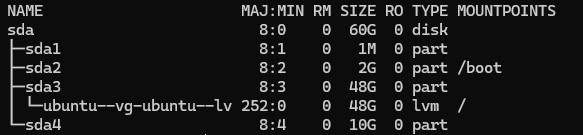
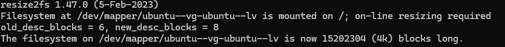
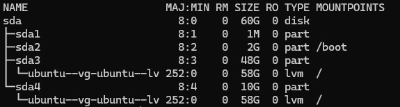

Logical Volume Manager (LVM) is a tool that allows dynamic resizing, snapshots, and efficient management of storage. In this post, I will walk you through the basics of LVM and provide a step-by-step guide to create or extend logical volume on devices running Linux.

## Create LVM 

## Extend LVM

In this example i will show you how to extend root volume in Ubuntu

Check your volume

```sh
lsblk
```

In this example you can i have partion sda3 for mount point / and i want extend / from 48GB to 58GB


```sh
pvcreate /dev/sda4
```


Extend volume group to include sda4

```sh
vgextend ubuntu-vg /dev/sda4
```

Extend the logical volume

use this command `lvextend -l +100%FREE /dev/<vg-name>/<lv-name>>`

```sh
lvextend -l +100%FREE /dev/ubuntu-vg/ubuntu-lv
```
Now run ``resize2fs`` command to implement above size to file system

resize the filesystem

```sh
resize2fs /dev/mapper/ubuntu--vg-ubuntu--lv
```


Check to confirm the result

```sh
lsblk
```

